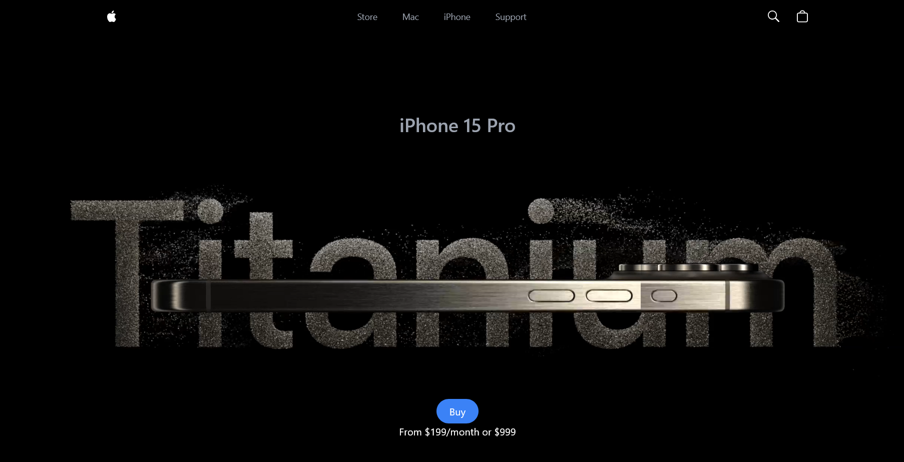
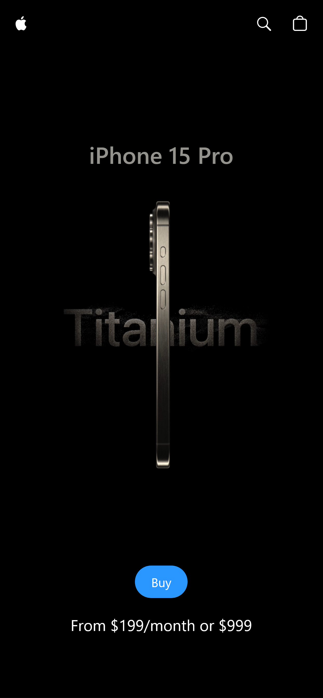

# 🍎 Apple iPhone 15 Pro Website Clone

A visually stunning and fully responsive clone of the official [Apple iPhone 15 Pro](https://www.apple.com/iphone-15-pro/) landing page. This project showcases modern web technologies like React, Three.js, GSAP, and Tailwind CSS — bringing Apple's elegant product presentation to life with 3D models and smooth animations.

---

## 🔗 Live Demo

🌐 [View the Project](https://apple-i-phone-six.vercel.app/)

## Screenshots

### Desktop View



### Mobile Footer View
.
> 💡 *Place your screenshots inside `public/screenshots/` folder with the correct filenames (`desktop.png`, `mobile.png`), or update the paths above.*

---

## 📋 Table of Contents

- [📸 Screenshots](#-screenshots)
- [📦 Tech Stack](#-tech-stack)
- [✨ Features](#-features)
- [⚙️ Installation](#️-installation)
- [🚧 Known Issues](#-known-issues)
- [📂 Project Structure](#-project-structure)
- [📜 License](#-license)
- [📣 Credits](#-credits)

---

## 📦 Tech Stack

| Tech | Description |
|------|-------------|
| **React.js** | JavaScript library for building UIs |
| **Three.js** | JavaScript 3D library |
| **React Three Fiber** | React renderer for Three.js |
| **GSAP** | JavaScript animation library |
| **Tailwind CSS** | Utility-first CSS framework |
| **Vite** | Next-generation frontend build tool |

---

## ✨ Features

- ⚙️ **Interactive 3D iPhone Model** – Rotate, animate, and interact using Three.js & React Three Fiber
- 🌀 **GSAP-powered Animations** – Smooth transitions and scroll-triggered effects
- 📱 **Fully Responsive** – Optimized layout for all screen sizes
- 🎥 **Custom Video Carousel** – Built with GSAP and responsive for mobile
- 🧩 **Reusable Components** – Clean and scalable component structure
- 🌙 **Dark-themed UI** – Elegant, Apple-inspired visuals

---

## ⚙️ Installation

### 📌 Prerequisites

- [Node.js](https://nodejs.org/)
- [npm](https://www.npmjs.com/)
- [Git](https://git-scm.com/)

### 📥 Setup Steps

```bash
# 1. Clone the repository
git clone https://github.com/welidemezene/Apple-iPhone.git
cd Apple-iPhone

# 2. Install dependencies
npm install

# 3. Start development server
npm run dev
Then visit http://localhost:5173 in your browser.

🚧 Known Issues
Mobile Overflow: Some devices may show horizontal scroll. Add overflow-x: hidden and use max-w-screen classes.

3D Model Performance: Complex 3D models might cause lag on older phones.

iOS Safari Bugs: Consider using 100vh and 100dvh carefully.

✅ Test responsiveness using iPhone 12 Pro (390px width) or Chrome DevTools device toolbar.

📂 Project Structure
arduino
Copy
Edit
├── public/
│   └── screenshots/
├── src/
│   ├── components/
│   ├── constants/
│   ├── utils/
│   ├── App.jsx
│   ├── main.jsx
├── index.html
├── tailwind.config.js
├── vite.config.js
├── package.json
└── README.md
📣 Credits
👨‍🏫 Inspired by JavaScript Mastery

🎨 3D Models from Apple’s official site (for educational use)

👨‍💻 Developed by @welidemezene

📜 License
This project is intended for educational purposes only. All rights to original designs and models belong to Apple Inc.
