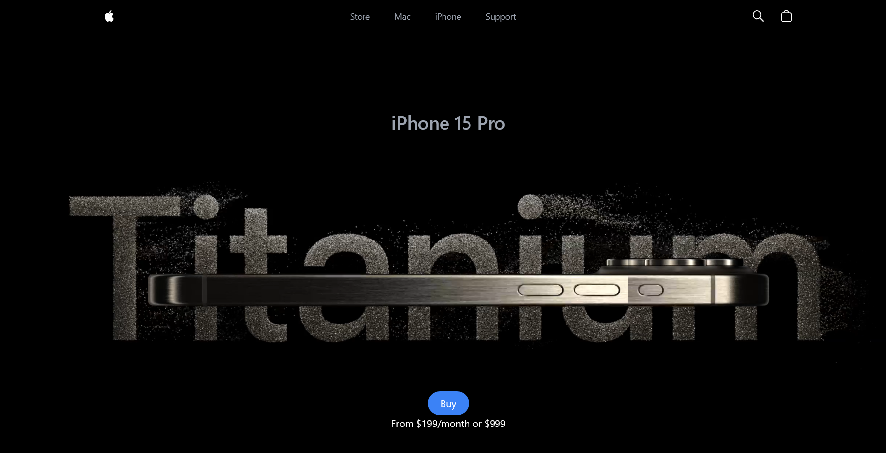

# 🍎 Apple iPhone 15 Pro - 3D Showcase Website

A sleek and immersive 3D iPhone 15 Pro showcase built with **React**, **Three.js**, **GSAP**, and **Tailwind CSS**.  
This project demonstrates rich animations, 3D product interaction, scroll-based transitions, and responsive design — inspired by Apple's marketing style.

## 🚀 Live Demo

👉 [View Live Site](https://apple-i-phone-six.vercel.app/)

---

## 🖥️ Desktop View

### 📱 Mobile Footer

---

## 🧪 Features

- 🌐 **Responsive Design** (mobile-first)
- 🎬 **Smooth GSAP Animations**
- 🧲 **3D Model Interaction** (rotate, zoom)
- 🎥 Scroll-based **video reveal**
- ⚡ Built with **React + Vite + Tailwind CSS**
- 🧩 Organized modular component structure

---

## 🛠️ Tech Stack

- **React** + **Vite**
- **GSAP** for animations
- **Three.js** with `@react-three/fiber` for 3D rendering
- **Tailwind CSS** for modern utility-based styling
- **React Router** (if needed for navigation)

---

## 🗂️ Project Structure

Apple-iPhone/
├── public/
│ └── assets/
│ └── images/
│ └── iphonehomepage.png
├── src/
│ └── components/
│ └── utils/
│ └── App.jsx
│ └── main.jsx
├── index.html
└── README.md

⭐ Don’t forget to star the repo if you liked it!
